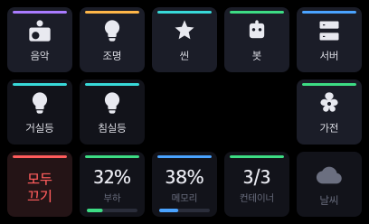
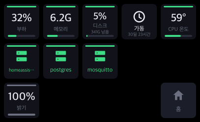
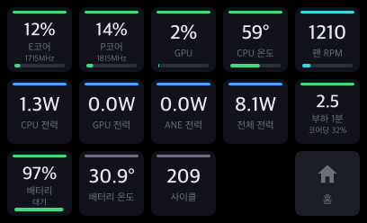

# streamdeck-station

**Elgato 앱 없이 헤드리스 맥에서 도는 Stream Deck 데몬** — Home Assistant 조명·씬,
Google Cast 스피커 음악 재생, launchd 자동화 잡, 서버 상태를 15개 버튼으로 제어합니다.

화면 없이 서버로 돌리는 맥(예: 클램쉘 맥북)에 Stream Deck을 꽂아
집 안 제어판 + 뮤직 스테이션 + 서버 대시보드로 쓰는 프로젝트입니다.
Node가 USB HID로 장치를 직접 잡으므로 Elgato Stream Deck 데스크톱 앱이 필요 없고,
버튼 배치가 전부 코드와 JSON 설정으로 관리됩니다.

| 홈 | 음악 |
|---|---|
|  |  |

| 서버 | 상세 모니터 |
|---|---|
|  |  |

## 기능

- **홈**: 페이지 이동 + 즐겨찾기 씬 + 부하/메모리/컨테이너 요약 + 날씨(HA weather) +
  재생 중인 곡명 표시
- **음악**: 재생 제어, 볼륨, 인터넷 라디오 프리셋, 스피커(캐스트 그룹) 선택.
  Cast 리시버가 곡 정보를 안 넘겨줘도 스트림의 ICY 메타데이터를 직접 읽어 곡명을 보여줍니다
- **조명/씬/가전**: HA 엔티티 토글·씬 실행. SmartThings 같은 클라우드 왕복 지연에도
  표시가 꼬이지 않도록 낙관적 상태 갱신
- **봇**: launchd 잡 상태(실행 중/실패/정상) 표시와 수동 실행
- **서버**: 부하·메모리·디스크·업타임·CPU 온도 + docker 컨테이너 상태/재시작
- **상세 모니터**: E/P코어·GPU 사용률, 전력, 팬, 배터리 (Apple Silicon, macmon)
- 되돌릴 수 없는 동작(컨테이너 재시작, 봇 실행)은 **두 번 눌러야** 실행됩니다
- 버튼 누름 즉시 로딩 표시, 변경된 칸만 다시 그리는 렌더 diff

## 요구 사항

- Stream Deck MK.2 (15키) — 다른 모델은 `@elgato-stream-deck/node`가 지원하면
  격자 크기 조정으로 대응 가능
- macOS + Node.js 18+ (Apple Silicon 권장 — CPU 온도·상세 모니터는 `brew install macmon` 필요)
- Home Assistant (조명·음악 기능) — 없으면 해당 페이지만 비활성화되고 데몬은 동작합니다
- 음악: HA에 Google Cast 등 `media_player` 통합 (예: Google Home Mini)

## 설치

```bash
git clone https://github.com/sglim/streamdeck-station.git && cd streamdeck-station
npm install && npm run build

cp config/config.example.json config/config.json   # 내 엔티티로 수정
echo 'export HA_TOKEN_STREAMDECK=<HA 장기 액세스 토큰>' > .envrc

node dist/main.js                    # 우선 직접 실행으로 확인
bash scripts/install-daemon.sh       # 로그인 시 자동 시작 (launchd)
```

HA 토큰은 HA 웹 UI → 프로필 → 보안 → 장기 액세스 토큰에서 만듭니다.
`.envrc`와 `config/config.json`은 gitignore 되어 있습니다.

하드웨어 없이 버튼 디자인만 확인하려면:

```bash
node dist/dev/preview-all.js /tmp    # 모든 페이지를 PNG로 렌더
```

## 설정

`config/config.example.json`을 복사해 시작하세요. 주요 항목:

| 키 | 설명 |
|---|---|
| `hass.url` / (`HA_TOKEN_STREAMDECK`) | HA 주소와 토큰 |
| `hass.players` | 음악 페이지 스피커 목록 (첫 항목이 기본) |
| `hass.radio` | 라디오 프리셋 — 스트림 URL 직접 지정 |
| `hass.lights` / `switches` / `scenes` / `appliances` | 각 페이지의 버튼 (최대 14개) |
| `hass.favorites` | 홈 화면 바로가기 (최대 4개) |
| `hass.weather` | 홈 날씨 버튼용 weather 엔티티 |
| `bots` | 봇 페이지에 표시할 launchd 잡 |
| `containers` | 서버 페이지에 표시할 docker 컨테이너 |

## 팁

- launchd에는 로그인 셸 PATH가 없습니다 — 설치 스크립트가 plist에 PATH를 명시합니다
- HA가 docker bridge 네트워크(colima 등)에 있으면 mDNS 자동 발견이 안 됩니다.
  Cast 통합에 기기 IP를 `known_hosts`로 직접 넣으세요
- 네트워크가 끊겼다 붙은 뒤 음악이 안 나오면 재생(▶) 대신 프리셋 버튼을 누르세요
  (죽은 캐스트 세션 대신 새 세션을 만듭니다)

## 라이선스

MIT
